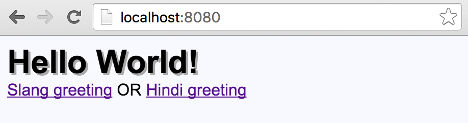

# Setup React Webpack

The aim of this book is to get you from concept to coding real world React apps,
as fast as possible.

React ecosystem is constantly evolving and changing at a fast pace. This book
equips you to take the right decisions matching your project requirements with best practices,
optimized workflows, and powerful tooling.

You will learn in this chapter how to setup React development environment starting
from scratch. By the end of this chapter we will have a starter boilerplate to
develop React apps.

We will cover following topics in this chapter.

- Why learn React, comparing with Angular 2.
- Shared learning path between React and Angular 2.
- How to install Node.js and use Node Version Manager.
- Setup package.json to manage your NPM dependencies.
- Quick access companion code for this book using Github.
- Install starter dependencies for React, Webpack, and Babel.
- Create Webpack configuration for development pipeline automation.
- Write and run your first Hello World React app.

{pagebreak}

## Why learn React comparing with Angular

A> This section is elaborating an answer by the author to a question on Quora.

**Why learn Angular 2?**  It is like learning Yoga, from one Guru, in a large group.

If you are in a **large** team, Angular will be your choice to get everyone on the same page, faster, at scale.
Contrary to popular opinion on the subject, we think Angular 2 is **faster** to learn when compared to React for the same goals, simply because you are making fewer "first-time-learner or developer" decisions along your journey.

- Angular2 and TypeScript are opinionated,
- Most documentation is "single version of truth" from one source (Google, the authors of Angular and Microsoft, the authors of TypeScript),
- There is mostly "one Angular/TypeScript way" of doing things, so fewer decisions to make along your learning and development journey,
- Angular 2 API and TypeScript language are well documented.
- Official samples are up to date with latest changes in the API, well mostly.
- Development boilerplates or starters are fairly mature, some like Angular Universal are backed by Google/Angular core team.
- The development and build tool-chain is mostly addressed by Angular/TypeScript, and few popular starter projects.

**Why learn React?** It is like doing cross-training, with multiple experts, at multiple locations.

If you are in a **lean** team or a single developer-designer-architect, "the React way" may be more fun.
Learning React is more **rewarding** in the long run. As you are making "hopefully informed" decisions all along your learning and development journey, you become a more thorough developer, designer, architect in the long haul. If you make your decisions by evaluating pros-cons of architectural and design patterns, you are becoming a better developer.

React is opinionated for fewer core concepts like one-way-data-binding.

- There are many ways to develop in React starting from how to define React components, how to create React build pipeline, which frameworks to integrate with, how to wire up a backend, the list goes on.
- You will learn from multiple sources and authors, not just Facebook/Instagram, the authors of React. Having these multiple perspectives will give you stronger real-world decision making muscles!
- Facebook and the React community is very driven by app performance patterns. Most core React concepts are centered around creating high performance code.
- The React community is more component driven. You will most likely find more reusable code.
- The community is also increasingly driven by "Developer Experience". Writing beautiful code, writing more manageable code, writing readable code, and tools that make developer's experience more fun and visual. See kadirahq/react-storybook as an example.

In our experience learning both and going back and forth helps. Programming design patterns remain the same. Syntactical sugar changes. Learning one, reinforces the other.

## Shared learning path between Angular 2 and React

A> This section is elaborating an answer by the author to a question on Quora.

**JavaScript.** JavaScript (ES5 and ES6) is fundamental. TypeScript transpiles to JavaScript. React-JSX-Babel tooling transpiles to JavaScript.

**CSS3.** You cannot do serious front-end coding without it.

**HTML5.** It is obvious, but extend your knowledge on concepts like Offline Storage and Device Access, best practice starters like HTML5 boilerplate.

**Webpack.** Modern day packaging, module bundling, build pipeline automation tooling.

**Design Patterns and Object Oriented principles.** Composition, Inheritance, Singletons, Pure Functions, Immutability, and many others are core concepts helping you in doing good development in general.

**Algorithms and data structures.** Serious development cannot be done without using these in a good measure.

**Backend as a Service.** Firebase, AWS Lamba, among others.

**Microservices and REST/APIs.** No modern app is built in isolation these days.

So, here is a learning path if you want to go beyond React. Learn React first, build some reusable components, learn the component design workflow. Learn Angular 2 next, try reusing your component design and above mentioned shared learning here. Maybe round off your knowledge by learning Meteor (more opinionated with best practice patterns for speed coding and performance) and integrating React and Angular, replacing Meteor's Blaze.

{pagebreak}

## Development Environment

This book assumes you have access to a Mac or Linux environment.

A> ## Are you on Windows?
A> You can try any of the Cloud based code editors which offer Linux Development
A> environment within the convenience of your web browser.
A> [Cloud9][1] is our favorite, other options include [Nitrous][2].

On Mac or Linux you can use your favorite code editor. This book is written using [Atom][1].
Atom gets you started coding by just dragging and dropping a folder onto the editor.
You can then add power user features as you grow with Atom using custom packages,
code snippets, among others.

### Installing Node.js

You will need Node.js to get started with React.
Your Mac OS comes with Node pre-installed. However you may want to use the latest stable release.

Check you node release using ```node -v``` command.

We recommend installing or upgrading Node using Node Version Manager (NVM).
Their [Github repo][4] documents install and usage.

To install NVM:

```
curl -o- https://raw.githubusercontent.com/creationix/nvm/v0.31.0/install.sh | bash
```

Now you can install a Node release by choosing one from Node [releases][5] page.

Command ```nvm install 5.10.1``` installs the latest stable release for us.

One of the advantages of using NVM is you can switch between multiple
node releases you may have on your system.

Here's what our terminal looks like when using ```nvm ls``` to list installed node releases.

{title="nvm ls terminal output", lang=text}
~~~~~~~
v4.2.3
v5.3.0
v5.10.0
->      v5.10.1
system
default -> 5.3.0 (-> v5.3.0)
node -> stable (-> v5.10.1) (default)
stable -> 5.10 (-> v5.10.1) (default)
iojs -> iojs- (-> system) (default)
~~~~~~~

Using ```nvm use x.x.x``` command we can switch to ```x.x.x``` installed node release.

{pagebreak}

### Setting up package.json

You will require ```package.json``` to manage your NPM dependencies and scripts.

Create a new one using ```npm init``` command, selecting defaults where uncertain.

This is what our ```package.json``` looks like as we start off. Note that we added
the ```private``` flag to avoid accidental publishing of the project to NPM repo,
and also to stop any warnings for missing flags like project repo.

{title="/package.json", lang=json}
~~~~~~~
{
  "name": "react-speed-coding-code",
  "version": "1.0.0",
  "description": "Companion code for React Speed Coding book",
  "main": "index.js",
  "private": true,
  "scripts": {
    "test": "echo \"Error: no test specified\" && exit 1"
  },
  "author": "Manav Sehgal",
  "license": "MIT"
}
~~~~~~~

Dependencies section will start showing up as we add npm dependencies.

## Companion code

Companion code and manuscript of this book are available at [reactspeedcoding Github repo][6].

Clone the repo like so.

```
git clone --depth=1 https://github.com/manavsehgal/reactspeedcoding.git
```

The ```--depth=1``` flag ensures that only the latest commit is cloned.

{title="reactspeedcoding repo file structure", lang=text}
~~~~~~~
- reactspeedcoding
-- manuscript # chapter content
-- code # sample code
~~~~~~~

Now cd to the code directory and install dependencies using ```npm install``` command.
Run sample app using ```npm start``` command.

{pagebreak}

## Installing Starter Dependencies

In summary, for our React environment, we have a dependency stack that
follows React > ES6 > Babel > Webpack. React recommends ES6 for latest features
and best practices. ES6 needs Babel for transpiling to ES5 and maintain browser compatibility.
Babel integrates with Webpack to stitch it all together for our app.

React is available via NPM and this is the recommended way of using React in a project.

{title="Install React dependencies", lang=text}
~~~~~~~
npm install --save react
npm install --save react-dom
~~~~~~~

Webpack is used for module packaging, development, and production pipeline automation.
We will get into more benefits of Webpack in the **Production Optimize Webpack** chapter.

{title="Install Webpack dependencies", lang=text}
~~~~~~~
npm install --save-dev webpack
npm install --save-dev webpack-dev-server
~~~~~~~

You can add functionality to Webpack using plugins. We will use automatic HTML
generation plugins for creating ```index.html``` for your app.

{title="Install Webpack plugins", lang=text}
~~~~~~~
npm install --save-dev html-webpack-plugin
npm install --save-dev html-webpack-template
~~~~~~~

Webpack requires loaders to process specific file types.

{title="Install Webpack loaders", lang=text}
~~~~~~~
npm install --save-dev css-loader
npm install --save-dev style-loader
~~~~~~~

Babel transpiles React JSX and ES6 to ES5 JavaScript. We need ```babel-loader```
as Webpack Babel loader for JSX file types.

Hot loading using ```babel-preset-react-hmre``` makes
your browser update automatically when there are changes to code,
without losing current state of your app.

ES6 support requires ```babel-preset-es2015``` Babel preset. We will discuss ES6 advantages
over ES5 and React specific best practices in chapter titled **ES6 React Guide**.

{title="Install Babel dependencies", lang=text}
~~~~~~~
npm install --save-dev babel-core
npm install --save-dev babel-loader
npm install --save-dev babel-preset-es2015
npm install --save-dev babel-preset-react
npm install --save-dev babel-preset-react-hmre
~~~~~~~

A> ## Presets in Babel
A> Presets in Babel are a collection of plugins as npm dependencies which help transform
A> source to target code using Babel. For [full list of such plugins][9] visit Babel's website.

## Configuring Babel

Babel configuration is specified in ```.babelrc``` file. React Hot Loading is
required only during development.

{title="/.babelrc", lang=json}
~~~~~~~
{
  "presets": ["react", "es2015"],
  "env": {
    "development": {
      "presets": ["react-hmre"]
    }
  }
}
~~~~~~~

{pagebreak}

## Creating Webpack configuration

Webpack configuration drives your development pipeline, so this is a really
important file to understand. We will split various sections of the config
file to aid step-by-step learning.

To start off, you need to initialize the config file with dependencies.
There are only two in case of development config, webpack and HTML generation plugin.

Next we initialize the APP, BUILD, and STYLE paths.

{title="/webpack.config.js initialization", lang=javascript}
~~~~~~~
const webpack = require('webpack');
const HtmlWebpackPlugin = require('html-webpack-plugin');

const APP = __dirname + '/app';
const BUILD = __dirname + '/build';
const STYLE = __dirname + '/app/style.css';
~~~~~~~

Next section defines your app entry, output, and extensions.

{title="/webpack.config.js paths and extensions", lang=javascript}
~~~~~~~
module.exports = {
  entry: {
    app: APP,
    style: STYLE
  },
  output: {
    path: BUILD,
    filename: '[name].js'
  },
  resolve: {
    extensions: ['', '.js', '.jsx']
  },
~~~~~~~

We follow this by defining the loaders for processing various file types
used within our app.

{title="/webpack.config.js loaders", lang=javascript}
~~~~~~~
module: {
  loaders: [
    {
      test: /\.jsx?$/,
      loaders: ['babel?cacheDirectory'],
      include: APP
    },
    {
      test: /\.css$/,
      loaders: ['style', 'css'],
      include: APP
    }
  ]
},
~~~~~~~

Now that we have loaders configured, let us add settings for our development
server. Source maps are used for debugging information. The ```devServer```
settings are picked up by ```webpack-dev-server``` as it runs.

{title="/webpack.config.js dev server settings", lang=javascript}
~~~~~~~
devtool: 'eval-source-map',

devServer: {
  historyApiFallback: true,
  hot: true,
  inline: true,
  progress: true,

  stats: 'errors-only',

  host: process.env.HOST,
  port: process.env.PORT
},
~~~~~~~

We now wrap up by adding plugins needed during our development.

{title="/webpack.config.js plugins", lang=javascript}
~~~~~~~
  plugins: [
    new HtmlWebpackPlugin({
      template: 'node_modules/html-webpack-template/index.ejs',
      title: 'React Speed Coding',
      appMountId: 'app',
      inject: false
    }),
    new webpack.HotModuleReplacementPlugin()
  ]
};
~~~~~~~

## Configuring startup scripts

We can configure startup scripts in ```package.json``` to speed up our development
even further.

{title="/package.json startup scripts", lang=json}
~~~~~~~
"scripts": {
  "start": "NODE_ENV=development webpack-dev-server",
  "build": "NODE_ENV=production webpack"
},
~~~~~~~

Both webpack and the webpack-dev-server will pick up webpack.config.js file
configuration.

{pagebreak}

## Hello World React

Now that we have our development environment setup, it is time to write some React!

A> ## React Naming Conventions
A> We are following React naming conventions from [Airbnb React/JSX Style Guide][7].
A> The style guide refers to naming, declaration, props, methods, among others.

We start by writing the entry point to our React app. This is the root component
which imports and renders the ```World``` component.

{title="/app/index.jsx app entry", lang=javascript}
~~~~~~~
import React from 'react';
import ReactDOM from 'react-dom';
import World from './components/World.jsx';

ReactDOM.render(
  <World />,
  document.getElementById('app')
);
~~~~~~~

A> ## ES6 React Guide
A> Do not worry about the new syntax that you may notice here. We will explain
A> each section in the chapter titled **ES6 React Guide**

Now we write the ```World``` component which renders the ```Hello``` component
with a message.

{title="/app/components/World.jsx World component", lang=javascript}
~~~~~~~
import React, {PropTypes} from 'react';
import Hello from './Hello.jsx';

export default class World extends React.Component {

  constructor(props) {
    super(props);
    this.state = {
      currentGreeting: props.greet,
      value: 'ReactSpeed'
    };
    this.slangGreet = this.slangGreet.bind(this);
    this.hindiGreet = this.hindiGreet.bind(this);
    this.handleNameChange = this.handleNameChange.bind(this);
  }

  slangGreet() {
    this.setState({currentGreeting: 'Yo!'});
  }

  hindiGreet() {
    this.setState({currentGreeting: 'Namaste'});
  }

  handleNameChange(event) {
    this.setState({value: event.target.value});
  }

  render() {
    const renderName = this.state.value ? this.state.value + ' says ' : '';
    const renderGreeting = renderName + this.state.currentGreeting;
    return (
      <div>
        <Hello greet={renderGreeting} message="World!" />
        <a className="link" onClick={this.slangGreet}>
          Slang
        </a> OR <a className="link" onClick={this.hindiGreet}>
          Hindi
        </a>
        <br /><br />
        <input
          type="text" value={this.state.value}
          placeholder="Enter a name"
          onChange={this.handleNameChange}
        />
      </div>
    );
  }
}

World.propTypes = {
  greet: React.PropTypes.string.isRequired,
}

World.defaultProps = {
  greet: 'Hello',
}
~~~~~~~

The ```Hello``` component renders Hello World message based on how ```World```
component calls it and current UI state. Current UI state changes as user clicks
on greeting language links. We are also processing ```input``` data
using ```this.state.value``` provided by React. The input control used in this
example does not maintain its own state. It is known as *Controlled Component* as opposed to
*Uncontrolled Component* if the value property is not used. Uncontrolled components
manage their own state. Read more about [handling forms][10] at Facebook React documentation.

Again, do not worry why we use a function here and not a class. All this will be
covered in the **ES6 React Guide** chapter.

{title="/app/components/Hello.jsx Hello component", lang=javascript}
~~~~~~~
import React from 'react';

export default function Hello(props) {
  return (
    <div className="title-shadow">
      {props.greet} {props.message}
    </div>
  );
}
~~~~~~~

We can add some styles to our app.

{title="/app/style.css Main Styles", lang=css}
~~~~~~~
body {
  font-family: Arial, 'Helvetica Neue', Helvetica, sans-serif;
  font-size: 100%;
  background: ghostwhite;
}

.title-shadow {
  font-size: 2em;
  text-shadow: 2px 2px darkgray;
  font-weight: bold;
}
~~~~~~~

A> ### Colors in CSS
A> You can pick colors in CSS using [W3Schools Color Names][8] table.
A> The table lists 140 colors, their HEX values, and also provides
A> really useful shading (gradients) and color mixing tools.

This completes our first React app. Now run the app using the development server.

```
npm start
```

Once the app runs you should see following message from webpack-dev-server in
your terminal window.

{title="npm start webpack-dev-server output", lang=text}
~~~~~~~
> react-speed-coding-code@1.0.0 start ...
> NODE_ENV=development webpack-dev-server

http://localhost:8080/
webpack result is served from /
content is served from ...
404s will fallback to /index.html
Child html-webpack-plugin for "index.html":

webpack: bundle is now VALID.
~~~~~~~

Browse to your app on the url mentioned in webpack output. Now try changing
some code like the style background or the Hello World message and hit save. Your
browser should update the app without refreshing state.



When this hot loading update happens you will see following output in the browser
console.

{title="browser console output", lang=text}
~~~~~~~
[HMR] App is up to date.
[React Transform HMR] Patching Hello
[HMR] Updated modules:
[HMR]  - 379
[HMR] App is up to date.
~~~~~~~

You can also build your app to serve it using any web server. First add a file server like so.

```
npm install -g serve
```

Now build and serve.

```
npm run build
serve build
```

You will see a different webpack output on your terminal this time.

{title="webpack output", lang=text}
~~~~~~~
> react-speed-coding-code@1.0.0 build ...
> NODE_ENV=production webpack

Hash: 004066b58d647f69ee8f
Version: webpack 1.12.15
Time: 1880ms
     Asset       Size  Chunks             Chunk Names
    app.js    1.82 MB       0  [emitted]  app
  style.js      52 kB       1  [emitted]  style
index.html  555 bytes          [emitted]  
    + 172 hidden modules
Child html-webpack-plugin for "index.html":
        + 3 hidden modules
~~~~~~~

Congratulations... You just built one of the most modern development environments
on the planet!

As you may have noticed the build is not highly optimized. The ```app.js``` file is
a huge ~2MB and css turned into JavaScript! In the chapter **Production Optimize Webpack**
we will discuss various techniques to optimize for a production environment.


[1]: https://atom.io/
[2]: https://c9.io/
[3]: https://www.nitrous.io/
[4]: https://github.com/creationix/nvm
[5]: https://nodejs.org/en/download/releases/
[6]: https://github.com/manavsehgal/reactspeedcoding
[7]: https://github.com/airbnb/javascript/tree/master/react
[8]: http://www.w3schools.com/colors/colors_names.asp
[9]: http://babeljs.io/docs/plugins/
[10]: https://facebook.github.io/react/docs/forms.html
