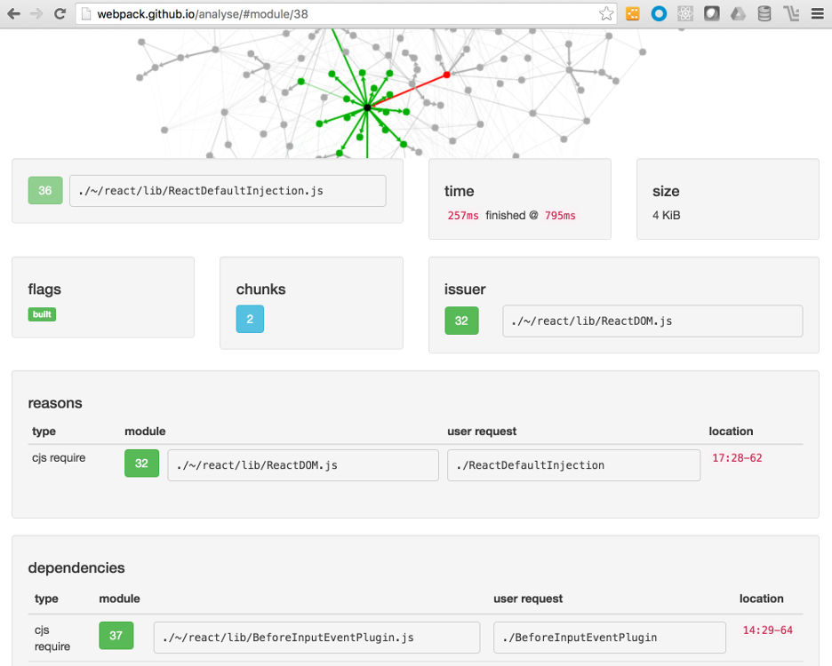

# Production Optimize Webpack

If you recall from the **Setup React Webpack** chapter, our build size is approaching 2MB.
This is not viable for a small Hello World app. In this chapter we will optimize our Webpack
configuration for production use case.

We will cover following topics in this chapter.

- Optimize React code for production bundle.
- Separate CSS for static or CDN serving.
- Bundle dependencies separately.
- Minify JavaScript code.
- Profiling Webpack generated build.
- Adding public assets for your app.
- Creating custom index template.

{pagebreak}

## Add production plugins and supporting dependencies

For production following plugins add functionality to Webpack.

```
npm install --save-dev clean-webpack-plugin
npm install --save-dev extract-text-webpack-plugin
```

The ```html-webpack-plugin``` recommends using ```html-minifier``` to minify HTML.

```
npm install --save-dev html-minifier
```
{pagebreak}

## Webpack production configuration

Let us create a production version of ```webpack.config.js``` so that we can pass
this to webpack in the ```npm run build``` script.

Initialization section adds the plugins for cleaning build directory for repeat builds
and extracting CSS for separate file in production.

We also parse the ```package.json``` dependencies for creating separate vendor
and manifest bundles.

{title="/webpack.prod.config.js initialization", lang=javascript}
~~~~~~~
const webpack = require('webpack');
const HtmlWebpackPlugin = require('html-webpack-plugin');
const CleanPlugin = require('clean-webpack-plugin');
const ExtractTextPlugin = require('extract-text-webpack-plugin');

const APP = __dirname + '/app';
const BUILD = __dirname + '/build';
const STYLE = __dirname + '/app/style.css';

const PACKAGE = Object.keys(
  require('./package.json').dependencies
);
~~~~~~~

Our next section is similar to development config. For production use case it adds chunkhash to file names.
This optimizes browser cache and CDN storage/retrieval as only updated files are downloaded
as you apply patches to your production code.

{title="/webpack.prod.config.js chunkhash", lang=javascript}
~~~~~~~
module.exports = {
  entry: {
    app: APP,
    style: STYLE,
    vendor: PACKAGE
  },
  resolve: {
    extensions: ['', '.js', '.jsx']
  },
  output: {
    path: BUILD,
    filename: '[name].[chunkhash].js',
    chunkFilename: '[chunkhash].js'
  },
~~~~~~~

We continue using Babel loader for JSX files. For CSS we use extract text plugin
so we can generate separate CSS file. This helps in browser caching as well as avoids
FOUC or Flash Of Unstyled Content during initial app loading within the browser.

{title="/webpack.prod.config.js extract css loader", lang=javascript}
~~~~~~~
module: {
  loaders: [
    {
      test: /\.jsx?$/,
      loaders: ['babel?cacheDirectory'],
      include: APP
    },
    // Extract CSS during build
    {
      test: /\.css$/,
      loader: ExtractTextPlugin.extract('style', 'css'),
      include: APP
    }
  ]
},
~~~~~~~

In the next and final section on adding plugins is where our production pipeline
actually kicks in.

**Clean build.** We start by cleaning our build directory of any past builds.

**Optimize HTML.** Then we continue with HTML webpack plugin to generate ```index.html```. We add
HTML minifying capability.

**Extract CSS.** Next the CSS is extracted as a separate file.

**Optionally Dedupe.** Larger projects may have dependency trees with duplicate files. Dedupe plugin removes such duplications. This option is commented out in the starter project as it has few dependencies and has no affect
on the build size.

**Separate JS bundles.** Vendor and manifest JavaScript files are bundled separately. This also helps in browser/CDN
caching as you may only do a release where one of them is updated, the other does not
need to be downloaded again to the client.

**React for production.** Facebook recommends React production settings to optimize the React library payload.

**Minify JS.** Finally we minify the JavaScript.

{title="/webpack.prod.config.js plugins", lang=javascript}
~~~~~~~
plugins: [
  new CleanPlugin([BUILD]),
  new HtmlWebpackPlugin({
    template: 'node_modules/html-webpack-template/index.ejs',
    title: 'React Speed Coding',
    appMountId: 'app',
    inject: false,
    // Use html-minifier
    minify: {
      collapseWhitespace: true
    }
  }),
  new ExtractTextPlugin('[name].[chunkhash].css'),
  new webpack.optimize.DedupePlugin(),
  new webpack.optimize.CommonsChunkPlugin({
    names: ['vendor', 'manifest']
  }),
  new webpack.DefinePlugin({
    'process.env': {
      'NODE_ENV': JSON.stringify('production')
    }
  }),
  new webpack.optimize.UglifyJsPlugin({
    compress: {
      warnings: false
    }
  })
]
};
~~~~~~~

Once you have created your production webpack config. You can update the ```npm run build``` script like so.

{title="/package.json script", lang=json}
~~~~~~~
"build": "NODE_ENV=production webpack --config webpack.prod.config.js"
~~~~~~~

Run the build using ```npm run build``` command.

{title="npm run build terminal output", lang=text}
~~~~~~~
> react-speed-coding-code@1.0.0 build ...
> NODE_ENV=production webpack --progress --colors --config webpack.prod.config.js

clean-webpack-plugin: .../build has been removed.
Hash: 3adfa1f966a9163f13ae  
Version: webpack 1.12.15
Time: 2805ms
                           Asset       Size  Chunks             Chunk Names
     app.72579f5463b4f31d58bb.js    2.25 kB    0, 3  [emitted]  app
   style.aa6472f39918066a1d46.js   38 bytes    1, 3  [emitted]  style
  vendor.d1a30b7942a4285bf9cf.js     139 kB    2, 3  [emitted]  vendor
manifest.ac5db0c8ee575afd5ff1.js  788 bytes       3  [emitted]  manifest
  style.aa6472f39918066a1d46.css  165 bytes    1, 3  [emitted]  style
                      index.html  713 bytes          [emitted]  
   [0] multi vendor 40 bytes {2} [built]
    + 167 hidden modules
Child html-webpack-plugin for "index.html":
        + 3 hidden modules
Child extract-text-webpack-plugin:
        + 2 hidden modules

~~~~~~~

You will notice in the terminal window that the overall size of your build is
reduced significantly when compared with the development release. The total size of optimized build is
~140 KB when compared with ~1,900 KB of development build. That is 92% reduction in size!

Your app also benefits from caching (separate files) and much smaller initial load time payload.

Wow! That is a lot of work. Fortunately you will not change this pipeline too often.
Worthwhile as a one-off investment as you build your React app to conquer the world!

{pagebreak}

## Profiling Webpack build

Webpack has developed a powerful tool to profile and analyze your build for further optimization.

Add following run script to ```package.json``` file.

```
"profile": "NODE_ENV=production webpack --config webpack.prod.config.js --profile --json > profile.json"
```

Now ```npm run profile``` to generate ```profile.json``` file with data on your build. You can pass this
file to [webpack analysis tool][8] for analyzing your build.



Using the analysis tool you can drill down into warnings, errors, hints on how to improve your code, and analyze
module chunks to further optimize your code.

{pagebreak}

## Public assets

Your production app will have several public assets including images, icons, among others.
We add ```/app/public``` folder and use this to store such public assets. During build we
want to copy this folder over to ```build``` folder. We add [CopyWebpackPlugin][10] to our
environment.

```
npm install --save-dev copy-webpack-plugin
```

We also reconfigure Webpack configs to add this copy task.

{title="Update webpack config initialization", lang=javascript}
~~~~~~~
const CopyWebpackPlugin = require('copy-webpack-plugin');
const PUBLIC = __dirname + '/app/public';
~~~~~~~

We also add the plugin to our Webpack processing pipeline.

{title="Update webpack config plugins", lang=javascript}
~~~~~~~
new CopyWebpackPlugin([
  { from: PUBLIC, to: BUILD }
],
{
  ignore: [
    '.DS_Store'
  ]
}),
~~~~~~~

Now when we run ```npm run build```, our public assets are copied over to the ```build``` folder.

We add other files recommended by HTML5 Boilerplate. Adding ```/app/styles/_normalize.css``` as an import to reset base styles. We also add ```Robots.txt```, ```humans.txt```, ```browserconfig.xml```, and ```crossdomain.xml``` files.

{pagebreak}

## Custom index template

We can now add a custom template to generate ```index.html``` using ```HtmlWebpackPlugin```.

This enables us to add ```viewport``` tag to support mobile responsive scaling of our app. We also add icons for mobile devices. Following best practices from HTML5 Boilerplate, we add ```html5shiv``` to handle IE9 and upgrade warning for IE8 users.

{title="/app/templates/index_default.html custom template", lang=html}
~~~~~~~
<!DOCTYPE html>
<html class="no-js" lang="">
  <head>
    <meta charset="utf-8">
    <meta http-equiv="X-UA-Compatible" content="IE=edge,chrome=1">
    <title>React Speed Coding</title>
    <meta name="description" content="">
    <meta name="viewport" content="width=device-width, initial-scale=1">

    <link rel="icon" href="/favicon.ico" />

    <!--[if lt IE 9]>
        <script src="//html5shiv.googlecode.com/svn/trunk/html5.js"></script>
        <script>window.html5 || document.write('<script src="js/html5shiv.js"><\/script>')</script>
    <![endif]-->
  </head>
  <body>
    <!--[if lt IE 8]>
        <p class="browserupgrade">You are using an <strong>outdated</strong> browser. Please <a href="http://browsehappy.com/">upgrade your browser</a> to improve your experience.</p>
    <![endif]-->

    <div id="app"></div>
    <!-- Google Analytics: change UA-XXXXX-X to be your site's ID. -->
  </body>
</html>
~~~~~~~

Once this is done we can safely remove ```html-webpack-template``` like so.

```
npm uninstall --save-dev html-webpack-template
```

Earlier we were using default template provided by this plugin, however now that
we have a custom template, this plugin is no longer required.

Updating webpack configs for ```HtmlWebpackPlugin```.

Adding ```TEMPLATE``` constant to initialization section.

```
const TEMPLATE =  __dirname + '/app/templates/index_default.html'
```

Updating the plugins section for both configs.

{title="Update webpack config plugins", lang=javascript}
~~~~~~~
new HtmlWebpackPlugin({
  template: TEMPLATE,
  inject: 'body'
}),
~~~~~~~

Note that we have also enabled the ```inject``` flag to ```body```. This will inject
the JavaScript resources at the end of the ```body``` tag as advised for improving
page load time.

{pagebreak}

## Issue using Hot Reloading with CSS imports

Hot Reloading works just fine for any changes within React code (JSX). However, as we make changes
to partials or CSS imports in ```/app/styles``` folder, these changes are not hot reloaded in the browser.
It works fine for changes within ```style.css``` though.

So, right now our workaround is to move frequently changing styles to base ```style.css``` during
active development and then relocate these to a proper import once we are close to production.

We are trying several possible solutions to this [know issue as PostCSS repo][12]. If you would like to contribute
a solution please [respond to this issue on our Github repo][13].

{pagebreak}

## Normalize.css from NPM (Code update 2016-04-21)

Normalize.css provides base styles and resets for our app. It is well maintained stylesheet and receives
regular updates. Earlier solution of "hard copying" it in ```/app/styles``` meant we will need to track
changes to it and do so manually. Good news is that the stylesheet is available as an NPM dependency.

So, we have removed ```nomalize.css``` from ```/app/styles``` and added it as npm dependency like so.

```
npm install --save-dev normalize-css
```

Now we add ```postcss-easy-import``` which enables Webpack build to process ```@import```
even from ```node_modules``` directory directly.

```
npm install --save-dev postcss-easy-import
```

Importing ```postcss-easy-import``` in Webpack configs and adding a plugin for
processing ```@import``` like so. This enables processing partials with ```_prefix```
along with any css available as an npm dependency as well.

{title="Update webpack config plugins", lang=javascript}
~~~~~~~
#leanpub-start-insert
const PostcssImport = require('postcss-easy-import');
#leanpub-end-insert

// some code...

postcss: function () {
  return [
#leanpub-start-insert
    PostcssImport({
      addDependencyTo: webpack,
      prefix: '_'
    }),
#leanpub-end-insert
    precss,
    autoprefixer({ browsers: ['last 2 versions'] })
  ]
},
~~~~~~~

Now whenever ```normalize.css``` changes, we can run ```npm update``` to
update our development environment with ease.

This also sets us up for adding more npm maintained styles in the future.

{pagebreak}

## Recommended Reading List

We will refer to following excellent articles and posts in order to build our understanding
around production optimization when it relates to Webpack, React, and other components of our toolchain.

- **Webpack Examples.** [Webpack Github repo][9] has several examples that relate to build optimization.
- **Production Optimization.** Webpack [docs cover optimization][4] topics around chunking, minifying, and de-duplication.
- **Source Maps.** Article on [Optimizing React + ES6 + Webpack Production Build][5] discusses source maps optimization, repeats most of the recommendations from this list.
- **HTML Minifying.** The [HTML Webpack Plugin documentation][6] has options to generate index.html and minify HTML.
- **Production Source Maps.** This [article by Sentry][7] crash reporting tool makes a case for production source maps.
- **Build Optimization.** SurviveJS has excellent coverage on Webpack and specific chapter on [build optimization using Webpack][1].
- **Webpack Setup.** Post on [The Ultimate Webpack Setup][2] by Christian Alfoni.
- **Developer Workflow.** Webpack's "sparse" documentation on [build optimization][3] is more relevant for development workflow than production code.


[1]: http://survivejs.com/webpack_react/building_kanban/
[2]: http://www.christianalfoni.com/articles/2015_04_19_The-ultimate-webpack-setup
[3]: http://webpack.github.io/docs/build-performance.html
[4]: https://webpack.github.io/docs/optimization.html
[5]: http://moduscreate.com/optimizing-react-es6-webpack-production-build/
[6]: https://github.com/ampedandwired/html-webpack-plugin
[7]: http://blog.getsentry.com/2015/10/29/debuggable-javascript-with-source-maps.html
[8]: http://webpack.github.io/analyse
[9]: https://github.com/webpack/webpack/tree/master/examples
[10]: https://www.npmjs.com/package/copy-webpack-plugin
[11]: https://github.com/hail2u/node-csswring
[12]: https://github.com/postcss/postcss-loader/issues/8
[13]: https://github.com/manavsehgal/reactspeedcoding/issues/1
