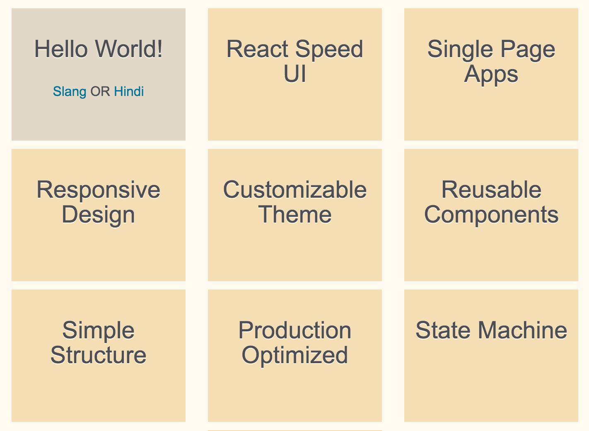

# React Speed UI

Now that we are comfortable with basic React, ES6 concepts and have a production
ready Webpack build pipeline, it is time to do some serious app development.

In this chapter we will start designing our very own React Speed UI framework
for your apps. We will do so using Flexbox, PostCSS, and custom React components.

## Design Goals

Designing a custom UI framework is an ambitious undertaking. Our task becomes achievable if we scope
our design goals upfront.

**Speed.** Like the name suggests, our UI framework is built for speed of development and
creating performant apps.

**Single Page App.** We will design various UI components required for a single page app including
landing page, buttons, forms, navigation menu, interactive content cards, and footer.

**Responsive.** Our app will be responsive and components will render according to target screen size.

**Customizable.** We want our UI framework to be easily customizable using custom color themes.

**Reusable.** The UI frameworks will be reusable across multiple apps.

**Simple.** We will keep our UI framework simple to understand, extend, and reuse.

**Optimized.** Speed UI framework will be production ready and optimized for light payloads.

**Reactive.** This topic is TBD. We will see if using Microservices and Reactive architectural patterns
can be in scope of this book.

**State Machine.** Our UI framework will support state management. This is topic for an advanced chapter,
however we will consider this goal as we design the framework.

**Expressive.** Our UI framework will be reusable in expressive, English like statements.

## PostCSS Processing

To helps us along in these design goals, PostCSS offers some great features.

As a simple analogy, [PostCSS][9] does for CSS what Babel does for JS.

**Autoprefixer.** You can write latest CSS rules and PostCSS Autoprefixer will
add vendor prefixes based on current browser popularity and support. Your post-processed CSS
always stays up-to-date with latest browser compatibility.

**CSSnext.** Future-proofing your code, use latest CSS features today. PostCSS coverts
to CSS current browsers support.

**CSS Modules.** Make your CSS code more modular, reusable, and maintainable.

**Speed.** PostCSS is faster than Less, Sass, others, when it concerns your development pipeline.
See [benchmarks here][14].

**Plugins.** PostCSS ecosystem has several plugins including Global CSS fixes, CSS readability, future CSS,
images and fonts, linters, and syntaxes similar to SCSS, SASS, LESS. See [list of plugins][10] here. You can search
plugins in a catalog at [postcss.parts][11].

We use following plugins for building Speed UI.

- The [Autoprefixer plugin][13], so that we don't need to worry about browser prefixes anymore.
- The [PreCSS plugin][12] enables Sass-like markup within CSS.

## Update Webpack for PostCSS

Before we proceed we need to add support for PostCSS in our build pipeline.

{title="Install PostCSS loader and dependencies", lang=text}
~~~~~~~
npm install --save-dev postcss-loader
npm install --save-dev precss
npm install --save-dev autoprefixer
~~~~~~~

Update Webpack configs (development and production) with PostCSS loader.

{title="Init PostCSS dependencies in both configs", lang=javascript}
~~~~~~~
const precss       = require('precss');
const autoprefixer = require('autoprefixer');
~~~~~~~

Development config will add ```postcss``` loader to ```css``` loaders.

{title="/webpack.config.js add PostCSS loader", lang=javascript}
~~~~~~~
module: {
  loaders: [
    {
      test: /\.jsx?$/,
      loaders: ['babel?cacheDirectory'],
      include: APP
    },
    {
      test: /\.css$/,
#leanpub-start-insert
      loaders: ['style', 'css', 'postcss'],
#leanpub-end-insert
      include: APP
    }
  ]
},
postcss: function () {
    return [precss, autoprefixer];
},
~~~~~~~

Production config will add ```postcss``` loader to ```ExtractTextPlugin```.

{title="/webpack.prod.config.js add PostCSS loader", lang=javascript}
~~~~~~~
module: {
  loaders: [
    {
      test: /\.jsx?$/,
      loaders: ['babel?cacheDirectory'],
      include: APP
    },
    // Extract CSS during build
    {
      test: /\.css$/,
#leanpub-start-insert
      loader: ExtractTextPlugin.extract('style', 'css!postcss'),
#leanpub-end-insert
      include: APP
    }
  ]
},
postcss: function () {
    return [precss, autoprefixer];
},
~~~~~~~

## Organizing and modularizing styles

Let us start organizing our styles. Right now from **Setup React Webpack** chapter
you have a very basic ```style.css``` located at app root.

We had a monolithic ```style.css```.

{title="/app/style.css Chapter 1 Styles", lang=css}
~~~~~~~
body {
  font-family: Arial, 'Helvetica Neue', Helvetica, sans-serif;
  font-size: 100%;
  background: ghostwhite;
}

.title-shadow {
  font-size: 2em;
  text-shadow: 2px 2px darkgray;
  font-weight: bold;
}
~~~~~~~

First, let us create a ```_theme.css``` to specify reusable theme variables. That way our
css can refer to these variables. Changes in one file will impact our entire UI framework.

{title="/styles/theme.css Page styles", lang=css}
~~~~~~~
$font-stack:      Arial, Helvetica, sans-serif;
$page-background: $white;
$page-padding:    2em;
~~~~~~~

Notice the variable ```$white``` is not defined yet. Before page styles, we need to define our primary color palette.

{title="/styles/theme.css Primary color palette", lang=css}
~~~~~~~
$white:     floralwhite;
$blue:      color(deepskyblue lightness(30%));
$red:       tomato;
$yellow:    wheat;
$black:     #4D4E53; /* charcoal gray */
~~~~~~~

As you can see we have started using Sass-like calculations within CSS. PostCSS will process this and convert to normal CSS.

Let us use these calculations to define secondary colors. Using calculations and changing lightness and saturation ensures
that colors are matching the primary palette.

{title="/styles/theme.css Secondary colors", lang=css}
~~~~~~~
$fadeblue:  color(deepskyblue saturation(30%));
$lightblue: color(deepskyblue lightness(80%));
$fadesand:  color(wheat saturation(30%));
$sand:      color(wheat lightness(80%));
$gray:      color($black lightness(80%));
~~~~~~~

Now let us define the base typography for React Speed UI. Again note the heavy use of variables and calculations.
Changes in few areas will change the whole theme for you. This wraps up the basic theme for us.

{title="/styles/theme.css Base typography", lang=css}
~~~~~~~
$h1-font-size: 3em;
$h2-font-size: calc( $h1-font-size * 80 / 100 );
$h3-font-size: calc( $h1-font-size * 60 / 100 );
$h4-font-size: calc( $h1-font-size * 40 / 100 );
$normal-font-size: calc( $h1-font-size * 33.3 / 100 );

$h1-line-height: 50px;
$h2-line-height: calc( $h1-line-height * 80 / 100 );
$h3-line-height: calc( $h1-line-height * 60 / 100 );
$h4-line-height: calc( $h1-line-height * 40 / 100 );
$normal-line-height: calc( $h1-line-height * 33.3 / 100 );

$heading-color:     $black;
$normal-font-color: $black;
$link-color:        $blue;
~~~~~~~

Let us now create ```_base.css``` and move the body styles there, while using variables
instead of hard coded values.

{title="/styles/base.css", lang=css}
~~~~~~~
body {
  color: $normal-font-color;
  background: $page-background;
  font-family: $font-stack;
  padding: $page-padding;
  font-size: 100%;
}
~~~~~~~

We also create ```_type.css``` and do away with the ```.title-shadow``` style in
favor of using headers. This will simplify our ```Hello``` component.

{title="/styles/type.css", lang=css}
~~~~~~~
p {
  color: $normal-font-color;
  font-size: $normal-font-size;
  line-height: $normal-line-height;
}

.heading {
  color: $heading-color;
  font-weight: lighter;
  text-shadow: 0 1px 0 $white;
}

h1 {
  @extend .heading;
  font-size: $h1-font-size;
  line-height: $h1-line-height;
}

h2 {
  @extend .heading;
  font-size: $h2-font-size;
  line-height: $h2-line-height;
}

h3 {
  @extend .heading;
  font-size: $h3-font-size;
  line-height: $h3-line-height;
}

h4 {
  @extend .heading;
  font-size: $h4-font-size;
  line-height: $h4-line-height;
}

a {
  color: $link-color;
  text-decoration: none;
  font-weight: lighter;

  &:hover {
    text-decoration: underline;
  }
}
~~~~~~~

We use more Sass-like features here including inheritance with ```@extend``` and nesting.

Now all that is left is to include all the partials or CSS modules we just created
within ```style.css```.

{title="/style.css" Import partials, lang=css}
~~~~~~~
@import 'styles/theme';
@import 'styles/base';
@import 'styles/type';
~~~~~~~

With this we have defined our generic styles for Speed UI. These styles will apply across components.
For component specific styles we follow the same principles as we learnt here.

- Create a partial or CSS module named after the component.
- Reuse variables from base theme.
- Inherit from other selectors where it makes sense.
- Import partial in ```style.css```.
- Design the component using the styles as HTML elements or using ```className```.

## Refactoring React components with Speed UI

Let us apply the new styles to refactor an existing component, before we start
creating new components.

Let us recollect how we designed the ```Hello``` component in **Setup React Webpack** chapter.

{title="/app/components/Hello.jsx Chapter 1 Hello component", lang=javascript}
~~~~~~~
import React from 'react';

export default function Hello(props) {
  return (
    <div className="title-shadow">
      {props.greet} {props.message}
    </div>
  );
}
~~~~~~~

Now that we have styles defined in ```_type.css``` for headings including shadow attribute,
let us simplify our component further.

{title="/app/components/Hello.jsx Refactored Hello component", lang=javascript}
~~~~~~~
import React from 'react';

export default function Hello(props) {
  return (
#leanpub-start-insert
    <h3>
      {props.greet} {props.message}
    </h3>
#leanpub-end-insert
  );
}
~~~~~~~

## Flexbox Layouts

Before we jump into creating new components let us understand Flexbox.

Flexbox takes care of some of the most important concerns in designing UI - layouts, alignment, and grids.

Flexbox is a CSS standard. It is also much less code to create layouts using Flexbox, as
the task of calculating grid size, placement, alignment, number of fitting elements is left to
the browser, instead of the designer. You can say Flexbox is more "developer friendly" in that sense.

Flexbox also lends itself very well to thinking in components and composability. It has a concept
of containers and contained elements. Similar to React way of containers and presentational components.

Let us create two new React components to illustrate how Flexbox and React thinking works in tandem.

We will create a ```Card``` component. It will be used to display a message.
A collection of ```Card``` components will be contained within ```CardStack``` component.

We want a bunch of ```Card``` components to be placed fitting the size of a ```CardStack``` component.
As the ```CardStack``` resizes for different screen sizes, we want the ```Card``` components to align, resize, and fit graciously and automatically.



This time let us start with the simpler component and work upstream in our design. Note that our ```Card```
component is a pure function or a stateless component. It receives a message text and returns a list item
to be rendered.

{title="/app/components/Card.jsx Card component", lang=javascript}
~~~~~~~
import React from 'react';

export default function Card(props) {
  return (
    <li className="card message">
      <h3>{props.message}</h3>
    </li>
  );
}
~~~~~~~

We can now define the styles for representing this component within ```_card.css```.
Note how nearly 50% of the style attribute values are reused from our base theme.

{title="/app/components/Card.jsx Card component", lang=javascript}
~~~~~~~
.card {
  color: $black;

  width: 200px;
  height: 150px;

  padding: 5px;
  margin-top: 10px;

  font-weight: lighter;
  line-height: $normal-line-height;
  font-size: $normal-font-size;
  text-align: center;
}

.message {
  background: $yellow;
}

.demo {
  background: $fadesand;
}
~~~~~~~

Our ```CardStack``` component will do much more. It will need to maintain a list of card messages.
It will also render demos included within the message card stack.

First, let us see how CardStack properties have been initialized.

{title="/app/components/CardStack.jsx CardStack properties", lang=javascript}
~~~~~~~
CardStack.propTypes = {
  messages: React.PropTypes.array.isRequired,
}

CardStack.defaultProps = {
  messages: [
    {id: 1, txt: 'React Speed UI'},
    {id: 2, txt: 'Single Page Apps'},
    {id: 3, txt: 'Responsive Design'},
    {id: 4, txt: 'Customizable Theme'},
    {id: 5, txt: 'Reusable Components'},
    {id: 6, txt: 'Simple Structure'},
    {id: 7, txt: 'Production Optimized'},
    {id: 8, txt: 'State Machine'},
    {id: 9, txt: 'Expressive Syntax'},
  ],
}
~~~~~~~

Next let us understand the class definition of our component. We note some ES6 features in play here.

We are using ```let``` keyword to define local scoped variable. Read more about [let statement][15] here.

We are also using arrow function expression => which is a short form for regular functions. Read more about [ arrow functions][16] here.

A React requirement of note here is the key attribute. List items require unique keys in React.

We have also consumed our ```World``` component as one of the ```CardStack``` list items.

{title="/app/components/CardStack.jsx CardStack class definition", lang=javascript}
~~~~~~~
import React from 'react';
import World from './World.jsx';
import Card from './Card.jsx';

export default class CardStack extends React.Component {
  render () {
    let messages = this.props.messages;
    let renderMessages = messages.map(message =>
        <Card key={message.id} message={message.txt} />
      );

    return (
      <ul className="stack">
        <li key="world" className="card demo">
          <World />
        </li>
        {renderMessages}
      </ul>
    );
  }
}
~~~~~~~

Finally it is time for some Flexbox magic. Let us add styles for ```CardStack``` component.
Contrast to our React code for the two components, the styles for ```CardStack``` are
deceptively very few lines of CSS. In fact Flexbox magic is just in the last three statements!

**Display.** First statement sets the display to ```flex``` instead of ```block``` or other options.

**Flow.** Next ```flex-flow``` sets the flow of contained elements by row or column, wrapping or nowrap,
forward direction or reverse.

**Justify.** Finally, ```justify-content``` decides how contained elements will be placed in relation to each other.
Options include space around, align with start of container, align with end, center, and space in between.

Also note that Flexbox styling only needs to be specified within the container.

{title="/app/styles/card.css CardStack styles", lang=css}
~~~~~~~
.stack {
  padding: 0;
  margin: 0;

  list-style: none;

  display: flex;
  flex-flow: row wrap;
  justify-content: space-around;
}
~~~~~~~

We have added more sample code so you are able to run the components from this chapter. In the next
chapter on **Component Design Workflow** we will design many more components and explain the remaining
code from this chapter's code commit.

## Recommended Reading List

- CSS Tricks has an awesome [guide to Flexbox][1]. We will use the code samples
in this guide as a starting point for our app.
- [Mozilla documents Flexbox][2] in detail, explaining the concepts, with samples.
- W3Schools explains [how Flexbox works][3] with code snippets.
- [PostCSS Deep Dive][8] is an excellent resource if you want to delve deeper into this awesome library.

[1]: https://css-tricks.com/snippets/css/a-guide-to-flexbox/
[2]: https://developer.mozilla.org/en-US/docs/Web/CSS/CSS_Flexible_Box_Layout/Using_CSS_flexible_boxes
[3]: http://www.w3schools.com/css/css3_flexbox.asp
[4]: https://github.com/postcss/postcss-loader
[5]: https://facebook.github.io/react/docs/thinking-in-react.html
[8]: http://webdesign.tutsplus.com/series/postcss-deep-dive--cms-889
[9]: http://postcss.org/
[10]: https://github.com/postcss/postcss
[11]: http://postcss.parts/
[12]: https://github.com/jonathantneal/precss
[13]: https://github.com/postcss/autoprefixer
[14]: https://github.com/postcss/benchmark
[15]: https://developer.mozilla.org/en/docs/Web/JavaScript/Reference/Statements/let
[16]: https://developer.mozilla.org/en/docs/Web/JavaScript/Reference/Functions/Arrow_functions
