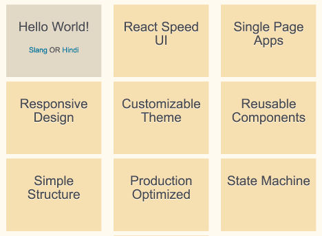
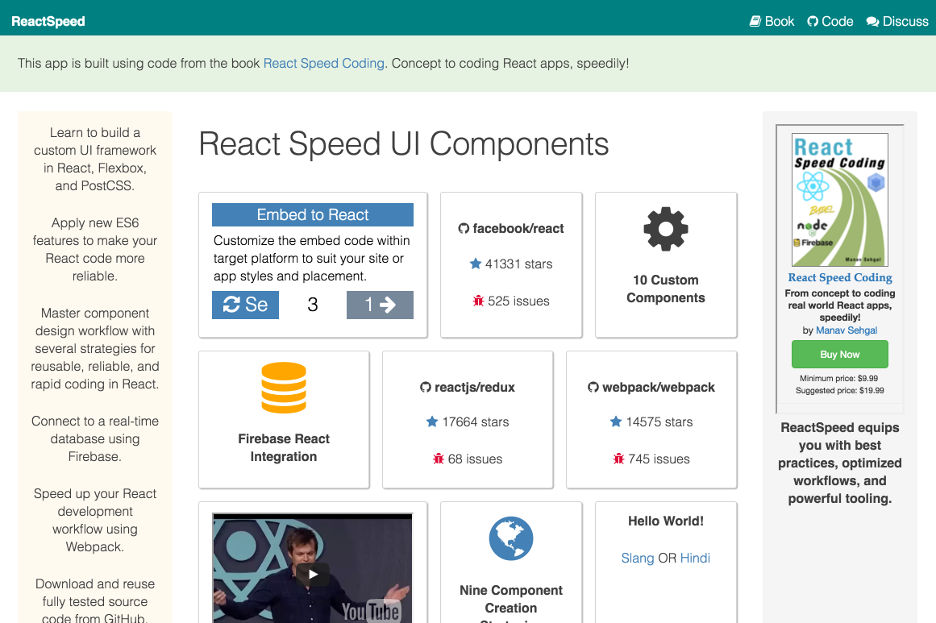

# React Speed UI

Now that we are comfortable with basic React, ES6 concepts and have a production
ready Webpack build pipeline, it is time to do some serious app development.

In this chapter we will start designing our very own React Speed UI framework
for your apps. We will do so using Flexbox, PostCSS, and custom React components.

You will learn following concepts in this chapter.

- React Speed UI objectives.
- PostCSS Processing.
- Update Webpack for PostCSS.
- Organizing and modularizing styles.
- Flexbox Layouts.
- Refactoring React components with Speed UI.
- CSS best practices.
- Refactor Speed UI methodology.

{pagebreak}

## React Speed UI objectives

Designing a custom UI framework is an ambitious undertaking. Our task becomes achievable if we scope
our design goals upfront.

**Speed.** Like the name suggests, our UI framework is built for speed of development and
creating performant apps.

**Single Page App.** We will design various UI components required for a single page app including
landing page, buttons, forms, navigation menu, interactive content cards, and footer.

**Responsive.** Our app will be responsive and components will render according to target screen size.

**Customizable.** We want our UI framework to be easily customizable using custom color themes.

**Reusable.** The UI frameworks will be reusable across multiple apps.

**Simple.** We will keep our UI framework simple to understand, extend, and reuse.

**Optimized.** Speed UI framework will be production ready and optimized for light payloads.

**Reactive.** This topic is TBD. We will see if using Microservices and Reactive architectural patterns
can be in scope of this book.

**State Machine.** Our UI framework will support state management. This is topic for an advanced chapter,
however we will consider this goal as we design the framework.

**Expressive.** Our UI framework will be reusable in expressive, English like statements.

{pagebreak}

## PostCSS Processing

To helps us along in these design goals, PostCSS offers some great features.

As a simple analogy, [PostCSS][9] does for CSS what Babel does for JS.

**Autoprefixer.** You can write latest CSS rules and PostCSS Autoprefixer will
add vendor prefixes based on current browser popularity and support. Your post-processed CSS
always stays up-to-date with latest browser compatibility.

**CSSnext.** Future-proofing your code, use latest CSS features today. PostCSS coverts
to CSS current browsers support.

**CSS Modules.** Make your CSS code more modular, reusable, and maintainable.

**Speed.** PostCSS is faster than Less, Sass, others, when it concerns your development pipeline.
See [benchmarks here][14].

**Plugins.** PostCSS ecosystem has several plugins including Global CSS fixes, CSS readability, future CSS,
images and fonts, linters, and syntaxes similar to SCSS, SASS, LESS. See [list of plugins][10] here. You can search
plugins in a catalog at [postcss.parts][11].

We use following plugins for building Speed UI.

- The [Autoprefixer plugin][13], so that we don't need to worry about browser prefixes anymore.
- The [PreCSS plugin][12] enables Sass-like markup within CSS.

{pagebreak}

## Update Webpack for PostCSS

Before we proceed we need to add support for PostCSS in our build pipeline.

{title="Install PostCSS loader and dependencies", lang=text}
~~~~~~~
npm install --save-dev postcss-loader
npm install --save-dev precss
npm install --save-dev autoprefixer
~~~~~~~

Update Webpack configs (development and production) with PostCSS loader.

{title="Init PostCSS dependencies in both configs", lang=javascript}
~~~~~~~
const precss       = require('precss');
const autoprefixer = require('autoprefixer');
~~~~~~~

Development config will add ```postcss``` loader to ```css``` loaders.

{title="/webpack.config.js add PostCSS loader", lang=javascript}
~~~~~~~
module: {
  loaders: [
    {
      test: /\.jsx?$/,
      loaders: ['babel?cacheDirectory'],
      include: APP
    },
    {
      test: /\.css$/,
#leanpub-start-insert
      loaders: ['style', 'css', 'postcss'],
#leanpub-end-insert
      include: APP
    }
  ]
},
postcss: function () {
    return [precss, autoprefixer];
},
~~~~~~~

Production config will add ```postcss``` loader to ```ExtractTextPlugin```.

{title="/webpack.prod.config.js add PostCSS loader", lang=javascript}
~~~~~~~
module: {
  loaders: [
    {
      test: /\.jsx?$/,
      loaders: ['babel?cacheDirectory'],
      include: APP
    },
    // Extract CSS during build
    {
      test: /\.css$/,
#leanpub-start-insert
      loader: ExtractTextPlugin.extract('style', 'css!postcss'),
#leanpub-end-insert
      include: APP
    }
  ]
},
postcss: function () {
    return [precss, autoprefixer];
},
~~~~~~~

{pagebreak}

## Organizing and modularizing styles

Let us start organizing our styles. Right now from **Setup React Webpack** chapter
you have a very basic ```style.css``` located at app root.

We had a monolithic ```style.css```.

{title="/app/style.css Chapter 1 Styles", lang=css}
~~~~~~~
body {
  font-family: Arial, 'Helvetica Neue', Helvetica, sans-serif;
  font-size: 100%;
  background: ghostwhite;
}

.title-shadow {
  font-size: 2em;
  text-shadow: 2px 2px darkgray;
  font-weight: bold;
}
~~~~~~~

First, let us create a ```_theme.css``` to specify reusable theme variables. That way our
css can refer to these variables. Changes in one file will impact our entire UI framework.

{title="/styles/theme.css Page styles", lang=css}
~~~~~~~
$font-stack:      Arial, Helvetica, sans-serif;
$page-background: $white;
$page-padding:    2em;
~~~~~~~

Notice the variable ```$white``` is not defined yet. Before page styles, we need to define our primary color palette.

{title="/styles/theme.css Primary color palette", lang=css}
~~~~~~~
$white:     floralwhite;
$blue:      color(deepskyblue lightness(30%));
$red:       tomato;
$yellow:    wheat;
$black:     #4D4E53; /* charcoal gray */
~~~~~~~

As you can see we have started using Sass-like calculations within CSS. PostCSS will process this and convert to normal CSS.

Let us use these calculations to define secondary colors. Using calculations and changing lightness and saturation ensures
that colors are matching the primary palette.

{title="/styles/theme.css Secondary colors", lang=css}
~~~~~~~
$fadeblue:  color(deepskyblue saturation(30%));
$lightblue: color(deepskyblue lightness(80%));
$fadesand:  color(wheat saturation(30%));
$sand:      color(wheat lightness(80%));
$gray:      color($black lightness(80%));
~~~~~~~

Now let us define the base typography for React Speed UI. Again note the heavy use of variables and calculations.
Changes in few areas will change the whole theme for you. This wraps up the basic theme for us.

{title="/styles/theme.css Base typography", lang=css}
~~~~~~~
$h1-font-size: 3em;
$h2-font-size: calc( $h1-font-size * 80 / 100 );
$h3-font-size: calc( $h1-font-size * 60 / 100 );
$h4-font-size: calc( $h1-font-size * 40 / 100 );
$normal-font-size: calc( $h1-font-size * 33.3 / 100 );

$h1-line-height: 50px;
$h2-line-height: calc( $h1-line-height * 80 / 100 );
$h3-line-height: calc( $h1-line-height * 60 / 100 );
$h4-line-height: calc( $h1-line-height * 40 / 100 );
$normal-line-height: calc( $h1-line-height * 33.3 / 100 );

$heading-color:     $black;
$normal-font-color: $black;
$link-color:        $blue;
~~~~~~~

Let us now create ```_base.css``` and move the body styles there, while using variables
instead of hard coded values.

{title="/styles/base.css", lang=css}
~~~~~~~
body {
  color: $normal-font-color;
  background: $page-background;
  font-family: $font-stack;
  padding: $page-padding;
  font-size: 100%;
}
~~~~~~~

We also create ```_type.css``` and do away with the ```.title-shadow``` style in
favor of using headers. This will simplify our ```Hello``` component.

{title="/styles/type.css", lang=css}
~~~~~~~
p {
  color: $normal-font-color;
  font-size: $normal-font-size;
  line-height: $normal-line-height;
}

.heading {
  color: $heading-color;
  font-weight: lighter;
  text-shadow: 0 1px 0 $white;
}

h1 {
  @extend .heading;
  font-size: $h1-font-size;
  line-height: $h1-line-height;
}

h2 {
  @extend .heading;
  font-size: $h2-font-size;
  line-height: $h2-line-height;
}

h3 {
  @extend .heading;
  font-size: $h3-font-size;
  line-height: $h3-line-height;
}

h4 {
  @extend .heading;
  font-size: $h4-font-size;
  line-height: $h4-line-height;
}

a {
  color: $link-color;
  text-decoration: none;
  font-weight: lighter;

  &:hover {
    text-decoration: underline;
  }
}
~~~~~~~

We use more Sass-like features here including inheritance with ```@extend``` and nesting.

Now all that is left is to include all the partials or CSS modules we just created
within ```style.css```.

{title="/style.css" Import partials, lang=css}
~~~~~~~
@import 'styles/theme';
@import 'styles/base';
@import 'styles/type';
~~~~~~~

With this we have defined our generic styles for Speed UI. These styles will apply across components.
For component specific styles we follow the same principles as we learnt here.

- Create a partial or CSS module named after the component.
- Reuse variables from base theme.
- Inherit from other selectors where it makes sense.
- Import partial in ```style.css```.
- Design the component using the styles as HTML elements or using ```className```.

{pagebreak}

## Refactoring React components with Speed UI

Let us apply the new styles to refactor an existing component, before we start
creating new components.

Let us recollect how we designed the ```Hello``` component in **Setup React Webpack** chapter.

{title="/app/components/Hello.jsx Chapter 1 Hello component", lang=javascript}
~~~~~~~
import React from 'react';

export default function Hello(props) {
  return (
    <div className="title-shadow">
      {props.greet} {props.message}
    </div>
  );
}
~~~~~~~

Now that we have styles defined in ```_type.css``` for headings including shadow attribute,
let us simplify our component further.

{title="/app/components/Hello.jsx Refactored Hello component", lang=javascript}
~~~~~~~
import React from 'react';

export default function Hello(props) {
  return (
#leanpub-start-insert
    <h3>
      {props.greet} {props.message}
    </h3>
#leanpub-end-insert
  );
}
~~~~~~~

{pagebreak}

## Flexbox Layouts

Before we jump into creating new components let us understand Flexbox.

Flexbox takes care of some of the most important concerns in designing UI - layouts, alignment, and grids.

Flexbox is a CSS standard. It is also much less code to create layouts using Flexbox, as
the task of calculating grid size, placement, alignment, number of fitting elements is left to
the browser, instead of the designer. You can say Flexbox is more "developer friendly" in that sense.

Flexbox also lends itself very well to thinking in components and composability. It has a concept
of containers and contained elements. Similar to React way of containers and presentational components.

Let us create two new React components to illustrate how Flexbox and React thinking works in tandem.

We will create a ```Card``` component. It will be used to display a message.
A collection of ```Card``` components will be contained within ```CardStack``` component.

We want a bunch of ```Card``` components to be placed fitting the size of a ```CardStack``` component.
As the ```CardStack``` resizes for different screen sizes, we want the ```Card``` components to align, resize, and fit graciously and automatically.



This time let us start with the simpler component and work upstream in our design. Note that our ```Card```
component is a pure function or a stateless component. It receives a message text and returns a list item
to be rendered.

{title="/app/components/Card.jsx Card component", lang=javascript}
~~~~~~~
import React from 'react';

export default function Card(props) {
  return (
    <li className="card message">
      <h3>{props.message}</h3>
    </li>
  );
}
~~~~~~~

We can now define the styles for representing this component within ```_card.css```.
Note how nearly 50% of the style attribute values are reused from our base theme.

{title="/app/components/Card.jsx Card component", lang=javascript}
~~~~~~~
.card {
  color: $black;

  width: 200px;
  height: 150px;

  padding: 5px;
  margin-top: 10px;

  font-weight: lighter;
  line-height: $normal-line-height;
  font-size: $normal-font-size;
  text-align: center;
}

.message {
  background: $yellow;
}

.demo {
  background: $fadesand;
}
~~~~~~~

Our ```CardStack``` component will do much more. It will need to maintain a list of card messages.
It will also render demos included within the message card stack.

First, let us see how CardStack properties have been initialized.

{title="/app/components/CardStack.jsx CardStack properties", lang=javascript}
~~~~~~~
CardStack.propTypes = {
  messages: React.PropTypes.array.isRequired,
}

CardStack.defaultProps = {
  messages: [
    {id: 1, txt: 'React Speed UI'},
    {id: 2, txt: 'Single Page Apps'},
    {id: 3, txt: 'Responsive Design'},
    {id: 4, txt: 'Customizable Theme'},
    {id: 5, txt: 'Reusable Components'},
    {id: 6, txt: 'Simple Structure'},
    {id: 7, txt: 'Production Optimized'},
    {id: 8, txt: 'State Machine'},
    {id: 9, txt: 'Expressive Syntax'},
  ],
}
~~~~~~~

Next we understand the class definition of our component. We note some ES6 features in play here.

A> ## ES6 let, const statements
A> We are using ```let``` statement to define block scope local variable. Read more about [let statement][15] here.
A> To make your code more readable and safer [Medium suggests][22] using const statement for
A> variables which will not be reassigned. cost follows same scoping rules as let.

A React requirement of note here is the key attribute. List items require unique keys in React.

A> ## ES6 Arrow functions
A> We are also using arrow function expression => which is a short form for regular functions.
A> Read more about [arrow functions][16] here.

We also consume our ```World``` component as one of the ```CardStack``` list items.

{title="/app/components/CardStack.jsx CardStack class definition", lang=javascript}
~~~~~~~
import React from 'react';
import World from './World.jsx';
import Card from './Card.jsx';

export default class CardStack extends React.Component {
  render () {
    const messages = this.props.messages;
    const renderMessages = messages.map(message =>
        <Card key={message.id} message={message.txt} />
      );

    return (
      <ul className="stack">
        <li key="world" className="card demo">
          <World />
        </li>
        {renderMessages}
      </ul>
    );
  }
}
~~~~~~~

Finally it is time for some Flexbox magic. Let us add styles for ```CardStack``` component.
Contrast to our React code for the two components, the styles for ```CardStack``` are
deceptively very few lines of CSS. In fact Flexbox magic is just in the last three statements!

**Display.** First statement sets the display to ```flex``` instead of ```block``` or other options.

**Flow.** Next ```flex-flow``` sets the flow of contained elements by row or column, wrapping or nowrap,
forward direction or reverse.

**Justify.** Finally, ```justify-content``` decides how contained elements will be placed in relation to each other.
Options include space around, align with start of container, align with end, center, and space in between.

Also note that Flexbox styling only needs to be specified within the container.

{title="/app/styles/card.css CardStack styles", lang=css}
~~~~~~~
.stack {
  padding: 0;
  margin: 0;

  list-style: none;

  display: flex;
  flex-flow: row wrap;
  justify-content: space-around;
}
~~~~~~~

We have added more sample code so you are able to run the components from this chapter. In the next
chapter on **Component Design Workflow** we will design many more components and explain the remaining
code from this chapter's code commit.

{pagebreak}

## Visual design principles

During the design of React Speed UI, we will try to reference many of the visual design principles.
For detailed categorization of these principles please refer to paper by Miles Kimball on this topic [Visual Design Principles: An Empirical Study of Design Lore][23] available on Academia.edu. For explanation of some
of the important principles along with best practice examples, you can refer to TutsPlus article on [A Comprehensive Introduction to Visual Design][26].

{pagebreak}

## CSS design methodologies

This section and the following sections are really important and these impact almost all chapters in this book.

So far we have evolved our CSS library organically. We have followed some
best practices, we may even have ignored some guidelines for ease of creating and reading early samples.
As our application and custom UI framework grows in size and complexity, so will our styles library.

Large CSS implementations are infamous for difficulty in maintainability. You can do three things to make
your CSS code as readable, reusable, and robust as your React code.

1. Follow component oriented design principles we follow in our React code.
2. Use naming conventions based on well established methodologies.
3. Incorporate linting and pre/post processing tools automation in your build pipeline.

While we have added PostCSS and other CSS optimization tools to our build pipeline, we will add
linting in the chapter **Test App Components**.

This section and next focus on 1 and 2. Following component oriented design principles. Developing our style methodology.

For CSS folders and organization, we will extend the [The 7-1 pattern][24] by Hugo Giraudel, which includes 7 folders
for partials and 1 main file for imports. Hugo has also made available a [GitHub repo][25] with boilerplate referencing the 7-1 pattern. Although the pattern describes Sass organization, it very well applies to CSS with PostCSS.

Some guidance on styles organization suggests keeping css and component jsx together. We see several benefits of keeping styles separate and not alongside components.

- We can organize styles using the popular 7-1 pattern used by many CSS frameworks.
- We can organize partials and main imports file in one place.
- Styles for container and presentational components can be in the same file. Firstly, these
styles are logically related, like flexbox container and child ordering. Secondly, container
components have minimal associated style information.
- If you have a designer and developer in your team, they could be working on their own
folders with clearly defined interfaces in the form of naming conventions and organization principles.
- You can easily package your UI framework styles for independent distribution if required.

Another set of best practices we will follow are around naming conventions.

Detailed CSS organization and naming best practices include [SMACSS][29], [BEM][30],
and [OOCSS][31], among many others.

We following simplified guidance from [modular CSS naming conventions][27] at The Sass Way, based on BEM and SMACSS.

A> ## 80:20 Rule for Naming Conventions
A> Note that we will be following BEM and other guidelines with an 80:20 rule.
A> Twenty percent of guidelines solve for 80% of the issues in creating maintainable, reusable, and readable CSS code.
A> So please do not look for strict adherence.
A>
A> You will also note that various libraries
A> follow their own variations. As long as you are clear about basic principles,
A> you will evolve your own set of guidelines from practice. And this is just fine as long as
A> you have these documented somewhere for the rest of your team.

As a starter for our refactoring journey, we are extending the excellent [Solved by Flexbox][21] samples repo
along with [SUIT CSS][32] libraries.

Solved by Flexbox is based on BEM with its own variation, so we will
refactor the sample code to work with our guidelines.

SUIT CSS is one of the most popular CSS libraries on GitHub, also used at Twitter,
again using BEM with a few variations.

Import relevant SUIT CSS libraries from NPM. These provide utility classes
for display types and text truncation, breaking, and alignment.

```
npm install --save-dev suitcss-utils-display
npm install --save-dev suitcss-utils-text
```
{pagebreak}

## Refactor Speed UI methodology

Let us refactor React Speed UI, developing our naming methodology, and reusing the starter libraries.

Following the 7-1 pattern we separate our styles into following folders.

- base: Contains theme variables and global resets.
- components: Contains partials representing our presentational components.
- containers: Partials for our container components.
- utils: Media queries, sizing, spacing, and compatibility.
- vendor: Specific styles for handling vendor library integration.

Our ```style.css``` entry point imports the partials in one place. We are no longer using underscore
prefix for our partials, so we can make our webpack configs a bit lighter by one line of code.

```javascript
PostcssImport({
  addDependencyTo: webpack,
  // prefix: '_'
}),
```

Next we rename ```demo.css``` sample from Solved by Flexbox to ```card.css```
and modify the class name to ```.card``` reflecting our component name. We apply following CSS guidelines
while editing ```card.css``` component styles.

A> ## React Speed UI Naming Methodology
A> We follow CSS style guidelines around component oriented design. Tightly associating how we name our
A> styles based on how we organize our React components, multi-component relationships, properties, and state.

- Owner React component styles are represented as objects or nouns and written in spinal-case. So ```.card``` style.
- Child nodes or contained React components are parent-child relationships represented as spinal-case.
- Parent-child styles are written in noun-noun or parent-object-child-object format.
- Parent and child styles are listed side-by-side and DO NOT use nesting. So ```.card-header``` style.
- Subclasses style component inheritance. Subclasses ```@extend``` base style objects. They are written in adjective-base-object format or subclass-base format. So ```.extended-card``` may extend ```.card``` to add more features.
- Modifiers are component properties or state.
- Modifiers are force applied to the object or component they refer by using the ampersand operator.
- Modifiers are written as adjectives or used descriptively. So ```&.is-message``` and ```&.is-spaced``` modifiers.
- Use nesting selectively only for modifiers, :pseudo-classes like :hover and ::pseudo-elements like ::after.
- No PascalCase or camelCase. Use hyphens instead.
- Alphabetical order of style attributes.
- Replace hex, hsl, rgb values of colors with CSS color names.
- Later on we can move color names to ```variables.css``` and use variables to build our reusable theme.

{title="/app/styles/components/card.css refactored code", lang=css}
~~~~~~~
.card {
  background: white;
  border: 1px solid lightgrey;
  border-radius: 3px;
  box-shadow: 1px 1px 1px 0px darkgrey;
  padding: .8em 1em 0;
  width: 100%;

  &::after {
    content: '\00a0'; /* &nbsp; */
    display: block;
    height: 0px;
    margin-top: 1em;
    visibility: hidden;
  }

  /* card modifiers */

  &.is-spaced {
    margin-bottom: var(--space);
  }

  &.is-message {
    cursor: pointer;
    transition: 1s background;

    &:hover {
      background: honeydew;
    }
  }
}
~~~~~~~

We then refactor ```grid.css``` based on our naming methodology.

{title="/app/styles/containers/grid.css refactored code", lang=css}
~~~~~~~
.grid {
  display: flex;
  flex-wrap: wrap;
  list-style: none;
  margin: 0;
  padding: 0;

  &.top {
    align-items: flex-start;
  }

  &.bottom {
    align-items: flex-end;
  }

  &.center {
    align-items: center;
  }

  &.justify-center {
    justify-content: center;
  }
}

.grid-cell {
  flex: 1;

  &.top {
    align-self: flex-start;
  }

  &.bottom {
    align-self: flex-end;
  }

  &.center {
    align-self: center;
  }

  &.auto-size {
    flex: none;
  }
}

/* more code available at reactspeedcoding GitHub repo... */
~~~~~~~

We can now refactor ```Card.jsx``` and ```CardStack.jsx``` to add styles from ```grid.css``` for
applying flexbox.

Notice that CardStack now defines the ```gridClass``` constant with significant verbosity. This reflects
the possible variations for setting up grids including gutters, text justification, and mobile
breakpoints for responsive grids.

Notice that one of our classes does not follow our no camelCase
guideline ```u-textCenter``` as this class is defined within SUIT CSS which we are importing using
NPM. We can live with this infrequent variation, remembering the 80:20 rule.

{title="/app/components/CardStack.jsx refactored code", lang=javascript}
~~~~~~~
// some code...
const gridClass = "grid grid-gutters grid-full grid-flex-cells large-grid-fit u-textCenter";

return (
  <div>
    <div className={gridClass}>
      <Card><Workflow /></Card>
      <Card><YouTube videoid="MGuKhcnrqGA" /></Card>
    </div>

// some code...
~~~~~~~

The Card component also changes slightly with ```grid-cell``` and ```card``` classes
added within the component render method. Adding ```grid-cell``` within Card component
has an added benefit of handling iterating cases and size variations through properties.
This also reduces the repetitive code in CardStack component.

{title="/app/components/Card.jsx refactored code", lang=javascript}
~~~~~~~
render() {
  const cardClass = this.props.message ? 'card is-message': 'card';
  const gridClass = this.props.size
    ? `grid-cell u-${this.props.size}`: `grid-cell`;

  return (
    <div className={gridClass}>
      <div className={cardClass}>
        {this.props.children}
      </div>
    </div>
  );
}
~~~~~~~

There is more refactoring done to the following. Latest code is downloadable from
reactspeedcoding GitHub repo.

- The ```Workflow``` component and styles.
- The ```Page``` component and ```holygrail``` styles.
- Adding ```modifiers.css``` for global modifiers.

Wow! We accomplished a lot in these sections. We now have many more style modules
which we will use in subsequent chapters to turn into React components. We have started creating our own
CSS design and naming methodology based on BEM and other best practice guidance. We have also
started seeing how our new style framework helps refactor existing components.



And, one more thing! With all these new styles, components, and reusable code, our production CSS
is all of 20KB in size. Compare that to most of the popular CSS frameworks, which range between
60KB to whooping +500KB, only for the minified CSS, JavaScript not even accounted for!

{pagebreak}

## Refactor theme

Now it is time to refactor our theme using the new methodology. We are using ```/app/styles/base/variables.css``` instead
of the earlier ```_theme.css``` partial. We continue using Sass-like ```$variable-name``` to capture
global theme variables. We move the color variations, using ```color($color-variable tint(20%))``` calculations
to the actual component modules for easier reference.

{title="/app/styles/base/variables.css theme variables", lang=css}
~~~~~~~

/* Spacing */
$space: 1.5em;
$space-lg: 2em;

/* Dark color palette. White overlay. */
$default: slategray;
$primary: steelblue;
$secondary: teal;
$danger: crimson;
$warning: tomato;
$success: mediumseagreen;
$golden: darkkhaki;

/* Light color palette. Black overlay. */
$default-light: whitesmoke;
$primary-light: lightsteelblue;
$secondary-light: lightcyan;
$danger-light: lightpink;
$success-light: honeydew;
$warning-light: mocassin;
$golden-light: floralwhite;
~~~~~~~

Notice that we are now using more *semantic* names for our variables. This is a recommended guideline,
as this makes our markup more readable and our intent clearer as to why we are using a particular color.

{pagebreak}

## Recommended Reading List

- Smashing magazine compiles the [Flexbox reading list][19].
- CSS Tricks has an awesome [guide to Flexbox][1]. We will use the code samples
in this guide as a starting point for our app.
- [Mozilla documents Flexbox][2] in detail, explaining the concepts, with samples.
- W3Schools explains [how Flexbox works][3] with code snippets.
- [Solved by Flexbox][21] has plenty of examples for using Flexbox.
- [PostCSS Deep Dive][8] is an excellent resource if you want to delve deeper into this awesome library.
- Smashing Magazine has a detailed post on [using various PostCSS plugins][20] with examples.
- Tool for aiding creation of [CSS box-shadows][17].
- Browse [trends in color palettes][18] as liked by thousands of users.

[1]: https://css-tricks.com/snippets/css/a-guide-to-flexbox/
[2]: https://developer.mozilla.org/en-US/docs/Web/CSS/CSS_Flexible_Box_Layout/Using_CSS_flexible_boxes
[3]: http://www.w3schools.com/css/css3_flexbox.asp
[4]: https://github.com/postcss/postcss-loader
[5]: https://facebook.github.io/react/docs/thinking-in-react.html
[8]: http://webdesign.tutsplus.com/series/postcss-deep-dive--cms-889
[9]: http://postcss.org/
[10]: https://github.com/postcss/postcss
[11]: http://postcss.parts/
[12]: https://github.com/jonathantneal/precss
[13]: https://github.com/postcss/autoprefixer
[14]: https://github.com/postcss/benchmark
[15]: https://developer.mozilla.org/en/docs/Web/JavaScript/Reference/Statements/let
[16]: https://developer.mozilla.org/en/docs/Web/JavaScript/Reference/Functions/Arrow_functions
[17]: http://www.cssmatic.com/box-shadow
[18]: http://www.colourlovers.com/palettes
[19]: https://www.smashingmagazine.com/2016/02/the-flexbox-reading-list/
[20]: https://www.smashingmagazine.com/2015/12/introduction-to-postcss/
[21]: https://philipwalton.github.io/solved-by-flexbox/
[22]: https://medium.com/javascript-scene/javascript-es6-var-let-or-const-ba58b8dcde75#.jppjlyz4r
[23]: https://www.academia.edu/11637848/Visual_Design_Principles_An_Empirical_Study_of_Design_Lore
[24]: https://sass-guidelin.es/#the-7-1-pattern
[25]: https://github.com/HugoGiraudel/sass-boilerplate
[26]: http://webdesign.tutsplus.com/articles/a-comprehensive-introduction-to-visual-design--cms-26224
[27]: http://thesassway.com/advanced/modular-css-naming-conventions
[28]: http://oxygencss.com/book/02-oxygen-naming-conventions.html
[29]: https://smacss.com/
[30]: http://getbem.com/introduction/
[31]: https://www.smashingmagazine.com/2011/12/an-introduction-to-object-oriented-css-oocss/
[32]: https://github.com/suitcss/suit
