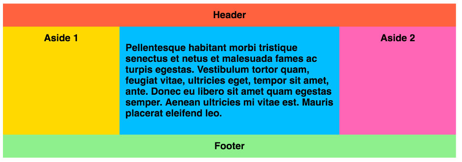
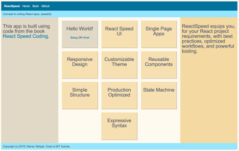

## Starting React component design (S)

If the blank, dark code editor window is staring back at you, do not despair. We will run through 10
different ways you can get started building your components in React!

The objective at this stage is to speedily "prototype" new features and code within your React project.
Subsequent chapters on **Designing Component Internals**, **Wiring Multiple Components**, and **Refactoring Existing Components** will go over best practices to create performant, reusable, and maintainable code.

Here is what you will learn in this chapter along with sample code.

- Designing React components rapidly from samples available on the Web.
- Using Web Embeds like YouTube, Flickr, Twitter, to create React components.
- Integrating third-party REST APIs to start creating React components.
- Moving from a wireframe to a React component.
- Designing mock and converting it to a React component.
- Creating a working prototype and translating this to a React component.
- Starting with a data table and turing this into a React component.
- How to handle real-time streams as a React component.
- How to model documents as a React component.
- How to enhance HTML elements as React components.

## Sample to React (Ss)

You may want to start with an existing single page sample
available on Github or on one of the tutorial websites. Normally this is accompanied
with JSFiddle, CodePen, or similar tools where you can play around with the functionality,
before deciding to bring the code into React.

This is a good place to start your component design journey. The broad sequence of steps are outlined here.

1. Identify root level component name that represents your sample. Define the basic React component.
2. Split sample code HTML, CSS, JavaScript into separate files.
3. Copy HTML DOM that renders the sample UI, into ```render()``` function of the root level component.
4. Optionally, replace some of the HTML with existing reusable components you may already have in your app.
5. Copy CSS into new or existing partial.
6. The JavaScript, if any, can be copied into ```/app/public/js``` folder or, if available over CDN,
referred in ```<script>``` tag from ```/app/templates/index_default.html```.
7. Import the new component into your ```index.jsx``` and create an instance in ```render()``` function.

Advantage of this approach is you get to experiment on features and integration requirements early on
in your development cycle. You also start modularizing various parts of the sample functionality, like
splitting the CSS, JS, and HTML. As your build pipeline (Webpack) is ready to consume these files, you
will run the sample in no time within your app folders and files organization. This also makes it easier
to refactor iteratively as you go over more advanced stages of the component design workflow.

For ReactSpeed website we start with a [sample provided by CSS Tricks][1]. We decide to combine
multiple samples in this tutorial to achieve our target page layout complete with navigation,
header, footer, sidebars, and main content area.



**Step 1:** We determine that our root level component will be simply called ```Page```.

We start by defining our component. At this stage we could define this component
simply as a stateless component, using pure function instead of class, like we did in case of ```Hello```
component earlier. Root level components mostly end up as classes with some state
management, so we stick to class definition to start with.

Note that we import ```CardStack``` component we designed in earlier chapter. We will replace
some of the HTML from the sample with our reusable component.

{title="/app/components/Page.jsx Page component definition", lang=javascript}
~~~~~~~
import React from 'react';
import CardStack from './CardStack.jsx';

export default class Page extends React.Component {
~~~~~~~

**Step 2, 3:** CSS Tricks sample is nicely modularized in HTML and CSS, so this makes it
easier for us to follow the above mentioned workflow.

We quickly put together our new component, mostly copying over the HTML from the sample.

{title="/app/components/Page.jsx render() function", lang=javascript}
~~~~~~~
render() {
  return (
    <div className="wrapper">
      <ul className="navigation">
        <li><a className="brand" href="/">ReactSpeed</a></li>
        <li><a href="/">Home</a></li>
        <li><a href="https://leanpub.com/reactspeedcoding">Book</a></li>
        <li><a href="https://github.com/manavsehgal/reactspeedcoding">Github</a></li>
      </ul>
      <header className="header">Concept to coding React apps, speedily!</header>
      <article className="main">
        <CardStack />
      </article>
      <aside className="aside aside-1">
        <h3>This app is built using code from the book <a href="https://leanpub.com/reactspeedcoding">React Speed Coding</a>.</h3>
      </aside>
      <aside className="aside aside-2">
        <h3>
        ReactSpeed equips you, for your React project requirements,
        with best practices, optimized workflows, and powerful tooling.
        </h3>
      </aside>
      <footer className="footer">
        Copyright (c) 2016, Manav Sehgal. Code is MIT license.
      </footer>
    </div>
  );
}
~~~~~~~

**Step 4:** Note that we replaced some of the sample HTML within ```<article>``` tag with
our reusable ```CardStack``` component instance.

**Step 5:** We copy the CSS styles into three new partials for navigation and page wrapper.

We have further reduce the CSS code and make it more reusable, by using nesting and variables
from the ```_theme.css``` we defined earlier.

{title="/app/styles/navigation.css Navigation styles", lang=css}
~~~~~~~
.navigation {
  list-style: none;
  margin: 0px;
  background: $blue;

  display: flex;
  flex-flow: row wrap;
  justify-content: flex-start;

  .brand {
    font-weight: bolder;
  }

  a {
    text-decoration: none;
    display: block;
    padding: 0.5em;
    color: $white;

    &:hover {
      background: $fadeblue;
    }

  }
}

@media all and (max-width: 800px) {
  .navigation {
    justify-content: space-around;
  }
}
@media all and (max-width: 600px) {
  .navigation {
    flex-flow: column wrap;
    padding: 0;

    a {
      text-align: center;
      padding: 10px;
      border-top: 1px solid rgba(255, 255, 255, 0.3);
      border-bottom: 1px solid rgba(0, 0, 0, 0.1);
    }

    li:last-of-type a {
      border-bottom: none;
    }
  }
}
~~~~~~~

Here is the code for page wrapper. Once you are done adding this partial, you can
update ```/app/style.css``` by adding ```@import <new partial name>```.

{title="/app/styles/wrapper.css Page Wrapper styles", lang=css}
~~~~~~~
.wrapper {
  display: flex;

  flex-flow: row wrap;
}

.wrapper > * {
  padding: 10px;
  flex: 1 100%;
}

.header {
  background: $lightblue;
}

.footer {
  background: $lightblue;
}

.main {
  text-align: left;
  background: $white;
}

.aside-1 {
  background: $fadesand;
  width: 200px;
}

.aside-2 {
  background: $sand;
  width: 200px;
}

@media all and (min-width: 600px) {
  .aside {
    flex: 1 auto;
  }
}
@media all and (min-width: 800px) {
  .main {
    flex: 6 0px;
  }

  .aside-1 {
    order: 1;
  }

  .main {
    order: 2;
  }

  .aside-2 {
    order: 3;
  }

  .footer {
    order: 4;
  }
}
~~~~~~~

**Step 6:** For this sample we can skip JS integration. However, in earlier chapter on **Production Optimize Webpack** we follow this strategy to integrate ```html5shiv``` JavaScript into ```/app/public/js``` folder.

**Step 7:** Now all that remains is to import the new ```Page``` component into ```index.jsx``` and
update the ```render()``` function to create an instance of our component like so.

{title="/app/index.jsx import and render Page component", lang=javascript}
~~~~~~~
import Page from './components/Page.jsx';

ReactDOM.render(
  <Page />,
  document.getElementById('app')
);
~~~~~~~

That's it! Now you can run your app as usual and see the new sample in action within
your React app.



The ReactSpeed website layout reflects our sample with significant variation in styles,
and addition of ```CardStack``` component capabilities.

## Embed to React (Se)

Many web platforms like Youtube, Flickr, and Twitter offer embed APIs to easily
integrate their platform features into your app.

## API to React (Sa)

You may want to integrate an existing API from the multitude of web service providers.

## Wireframe to React (Sw)

Start your React component creation journey with a simple wireframe.

## Mock to React (Sm)

You may have designed a mock for your app using tools like Sketch.

## Prototype to React (Sp)

Rapid prototyping tools take mocks a step further by building interactivity.

## Data table to React (St)

Sometimes you may have a dataset that you want to design into a component.

## Real-time stream to React (Sr)

Real-time streams of data like Twitter feeds, app instrumentation data, device sensor information,
can be thought about as a React component.

## Document to React (Sd)

Are you interested in representing a work document, report, or template as a
React component?

## HTML elements to React (Sh)

Do you want to add more capabilities to HTML markup elements? React can help.

I> ## Chapter In Progress
I> We are still writing this chapter. Please watch this space for updates.
I> Plan is to add examples for each of the 10 different ways for speedily
I> starting component design in React.

[1]: https://css-tricks.com/snippets/css/a-guide-to-flexbox/
