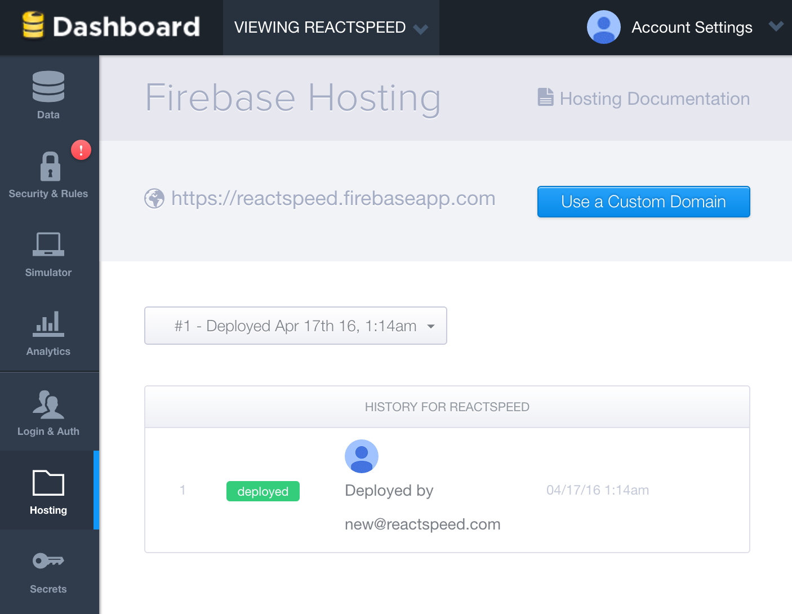

# Firebase React Integration

Firebase is a Platform as a Service offering managed, real-time database, user authentication APIs, and static (front-end) website hosting. We like Firebase as our backend and hosting platform as it is stable, backed by Google, provides well documented APIs, has an easy to learn visual database management toolset, and performant.

For the same price-point Firebase delivers much more than its competitors. As an example, it is hard to find a normal web host offering SSL custom domain hosting for $5/monthly. Firebase offers way more for this price. It also comes with a generous free plan which is easy to upgrade when you are ready to go production.

As this book progresses we are hosting the demo app at https://reactspeed.firebaseapp.com. Once the book completes and we have sufficient traction, we will migrate to our very own domain at https://reactspeed.com. Fingers crossed!

## Firebase Hosting

Getting started with Firebase hosting is easy. Install their Command Line Interface (CLI) tools. Use a Google account to authenticate.

```
npm install -g firebase-tools
```

Next do ```firebase init``` to setup your deploy directory. In our case this is the ```build``` folder. Run ```npm run build``` and then ```firebase deploy```. You are done. You can then ```firebase open``` from the terminal to open your new or updated website in your favorite browser. It is that easy.


