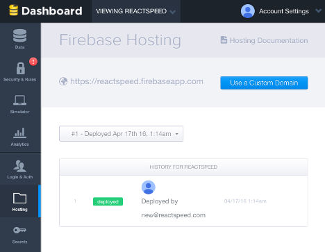
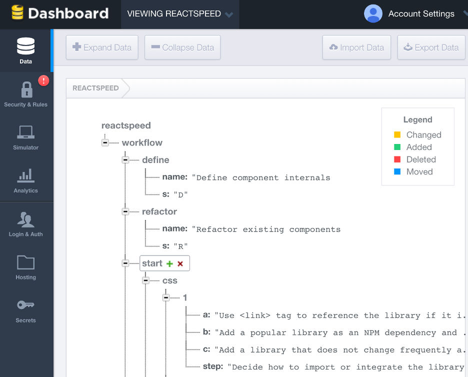

# Firebase React Integration

Firebase is a Platform as a Service offering managed, real-time database, user authentication APIs, and static (front-end) website hosting. We like Firebase as our backend and hosting platform as it is stable, backed by Google, provides well documented APIs, has an easy to learn visual database management toolset, and performant.

For the same price-point Firebase delivers much more than its competitors. As an example, it is hard to find a normal web host offering SSL custom domain hosting for $5/monthly. Firebase offers way more for this price point. It also comes with a generous free plan which is easy to upgrade when you are ready to go production.

As this book progresses we are hosting the demo app at https://reactspeed.firebaseapp.com. Once the book completes and we have sufficient traction, we will migrate to our very own domain at https://reactspeed.com. Fingers crossed!

Here is what you will learn in this chapter.

- Compare Firebase with another popular framework Meteor.
- Host your front-end app using Firebase hosting.
- How Firebase stores files and data.
- Designing a REST API using Firebase.
- For what kind of apps is Firebase not ideal.

{pagebreak}

## Comparing Firebase with Meteor

A> This section is elaborating an answer by the author to a question on Quora.

Both Meteor and Firebase can be used to build robust mobile-web apps. Differences in platform, database, hosting, and pricing are explained here.

**Platform.** Firebase = Real-time Database | Meteor = Web Framework

Firebase is focused on providing a real-time database platform and API which works well with Angular, React, Ember, effectively any popular front-end web framework or directly within mobile platforms like iOS and Android.

Meteor is focused on providing a web application framework that integrates nicely with other popular web frameworks like Angular and React. Meteor also integrates Cordova to enable write-once-publish-many across web and mobile for your apps. Meteor monetizes its open source efforts by providing paid Galaxy hosting for apps written in Meteor.

**Database.** Firebase = Real-time API over Mongo | Meteor = MongoDB API

Both Meteor and Firebase use MongoDB for database.

Meteor provides more direct, "power" Mongo access to the database API, within its framework. So, if you know Mongo, you will feel at home with many Meteor capabilities. Meteor also provides an innovative mini-Mongo API to create client-side data caching.

Firebase on the other hand provides its own real-time database management API which is more "constrained" and at the same time powerful and easier to learn for certain category of apps.

**Pricing.** Firebase = Easier bundling | Meteor = Scale and support based

Meteor Galaxy [pricing][2] is usage based or utility based pricing. Based on number of containers used by your app and number of hours these containers are running per month. Base pricing also varies based on level of support you require. Overall pricing will vary based on how your app scales and how it is used.

Firebase [pricing][1] is relatively simpler and offers more "visible" bundling of features. For a decent range of usage, scale, and performance, you can be assured of a relatively lower fixed price.

**Front-end.** Firebase = Angular, React, Many | Meteor = Blaze, Angular, React

Firebase provides API, integration libraries, and samples for web frameworks like Angular, Ember, Vue.js, and React. You can also deploy statically generated sites from tools like Jekyll and Harp.

Meteor supports Blaze as its front-end framework. It also integrates Angular and React.

**Server-side.** Firebase = Users, Security only | Meteor = Anything

Firebase provides limited "programmability" on the server-side through user management and authentication API and configurable database access security rules.

Meteor supports Universal JavaScript and server side processing capabilities out-of-the-box. So, using Meteor, you can build almost anything that requires server-side processing.

**Hosting.** Firebase = Web + CDN + Users + DB | Meteor = App only

Firebase provides hosting for front-end web apps written in plain HTML, CSS, and JS. Firebase also provides a Content Delivery Network (CDN) to help distribute your published websites in a performant way. Firebase hosting includes SSL for their lowest paid account.

Meteor provides Galaxy hosting for apps written in Meteor. As of this writing, Galaxy does not support database hosting. We personally find this constraint as "counter" Meteor goals of easing development on their platform, considering how neatly the database is tied into the whole framework with mini Mongo and server side Mongo database. You can use other paid services like [Compose][3] or [mLab][4] for database hosting.

**Portability.** Firebase = App portable | Meteor = Data queries portable

Potability is important for future-proofing your coding investment. A popular platform may stop general availability, like [Parse from Facebook][7]. You may also decide to reuse your code across multiple platforms and projects.

Firebase front-end is almost entirely portable as it can be written in any front-end web framework. Where you write Firebase specific code is within limited data change lister methods. In fact as Firebase uses JSON for storing data, your Create-Read-Update-Delete (CRUD) code can be made relatively portable. If you are writing user authentication
code, this uses OAuth protocols and Firebase API. Firebase data can be exported as JSON. Hosted apps on Firebase can move almost as-is to other static hosting providers like GitHub.

Meteor API cuts across client and server-side and Meteor is relatively more opinionated
to ensure your app follows the best practices the platform supports including DDP, Livequery, and Blaze.
The database access queries are written in MongoDB API, so these are relatively portable.
Meteor also enables you to swap its Blaze front-end layer with Angular or React.

**Organization.** Firebase = Google | Meteor = MDG

Both Meteor and Firebase have robust organizations.

Firebase is [acquired][6] by Google.

Meteor has +$31M in [funding][5] from leading Silicon Valley investors.

So, both platforms are a good choice for developing your next app. Firebase pricing is relatively
easier to grasp and enables more flexibility in your technology stack decisions.

{pagebreak}

## Firebase Hosting

Getting started with Firebase hosting is easy. Install their Command Line Interface (CLI) tools. Use a Google account to authenticate.

```
npm install -g firebase-tools
```

Next do ```firebase init``` to setup your deploy directory. In our case this is the ```build``` folder. This creates ```firebase.json``` file in our root with selected configuration.

{title="Firebase deploy terminal output", lang=text}
~~~~~~~
=== Deploying to 'reactspeed'...

i  deploying hosting
i  preparing build directory for upload...
- 6 files uploaded successfully

- Deploy complete!

URL: https://reactspeed.firebaseapp.com
Dashboard: https://reactspeed.firebaseio.com

Visit the URL above or run firebase open
~~~~~~~

Run ```npm run build``` and then ```firebase deploy```. You are done. You can then ```firebase open``` from the terminal to open your new or updated website in your favorite browser. It is that easy.



{pagebreak}

## How Firebase stores files and data

A> This section is elaborating an answer by the author to a question on Quora.

**JSON documents.** Firebase is built on top of one of the most mature and powerful NoSQL databases around, MongoDB. So Firebase data store is tree-like, JavaScript Object Notation (JSON) documents.

**Real-time API.** Firebase value adds on top of MongoDB with its real-time publish/subscribe API. What this means is you could have microservice A write to your Firebase data store and microservice B picks up the changes as these happen in near real-time. A and B microservices do not need to be on the same server or developed by the same entity. This makes Firebase really powerful for applications like chatting servers, streaming services, location intelligence, among others.

**Static Hosting and CDN.** Firebase also stores and serves front-end files (HTML, CSS, JS) using a Content Delivery Network (CDN) as a world class hosting platform. You could dynamically generate these files from a Node.js backed development server, use modern web application frameworks like React and Angular to deliver very capable mobile-web apps wired to a real-time database.

**Geo-spatial data.** Firebase has basic capabilities to store and retrieve Latitude/Longitude information along with JSON documents. This makes it ideal for many location aware apps, combined with its real-time data API, and performant front-end hosting for mapping embeds.

**User Profiles.** Firebase also stores basic user profiles and registration data. That is one less worry and an important aspect of any multi-tenant SaaS app.

**Complex UI state management.** This is experimental, however we are keen to explore if Firebase can
be used to persist in near real-time, complex UI state management. Use cases include deep personalization
of app UI state, so you come back to same settings you left your app last time you used it.

**Decision Trees.** JSON hierarchical data schema, real-time data change listening, REST API interface to your data schema, all combined can be a good use case for elaborate decision trees. These can support knowledge management and
machine learning apps.

**Gaming state.** Another variation on complex UI state management. Firebase could be used to create, read, update, and delete user gaming state in real-time.

{pagebreak}

## Designing a REST API using Firebase

Providing a REST API is essential for any app that works with data that can be
consumed by other apps. Normally writing an API for an app is an involved process.

Firebase provides visual data management tools that enable you to rapidly design
an API simply using a well designed JSON data schema. The structure of your JSON schema
becomes the API endpoints right out-of-the-box. You can then secure your API with
several authentication schemes, or just keep it available as an open data set.



For ReactSpeed API we want to expose component design workflow to other apps
which can consume this and add more features. One of the use cases may be a
project management app which brings up required workflow steps as a
pre-populated Todo List for its users.

We are effectively codifying or API enabling the entire React Speed Coding book
outline of contents for consuming within third-party apps!

Try ReactSpeed REST API in your console now.

```
curl "https://reactspeed.firebaseio.com/workflow/start/embed.json"
```

What returns is JSON data with steps outlined to complete **Embed to React** component
creation explained within the **Start Component Design** chapter.

{pagebreak}

## For what kind of apps is Firebase not ideal

A> This section is elaborating an answer by the author to a question on Quora.

**Server side continuous processes.** Firebase is not ideal, if your app requires continuous server side processing, like receiving streaming data from a source like Twitter, analyzing this in some way, before consuming the analytics results in your app in real-time.

**Full-stack or universal app frameworks.** You cannot run Meteor or Universal Angular on a platform like Firebase as these frameworks require server-side scripting.

**Large binary file processing.** If you are creating an image processing app, or a an online video post-processing tool, Firebase does not have much to offer in terms of shifting large binary files or processing these on the server side.


I> ## Chapter In Progress
I> We are still writing this chapter. Please watch this space for updates.
I> Plan is to add examples for wiring up our React Speed UI components with Firebase
I> as real-time database, add user authentication, determine security rules,
I> review hosting optimizations, among other actions.

[1]: https://www.firebase.com/pricing.html
[2]: https://www.meteor.com/why-meteor/pricing
[3]: https://www.compose.io/
[4]: https://mlab.com/
[5]: https://www.crunchbase.com/organization/meteor
[6]: https://www.crunchbase.com/organization/firebase
[7]: http://techcrunch.com/2016/01/28/facebook-shutters-its-parse-developer-platform/
